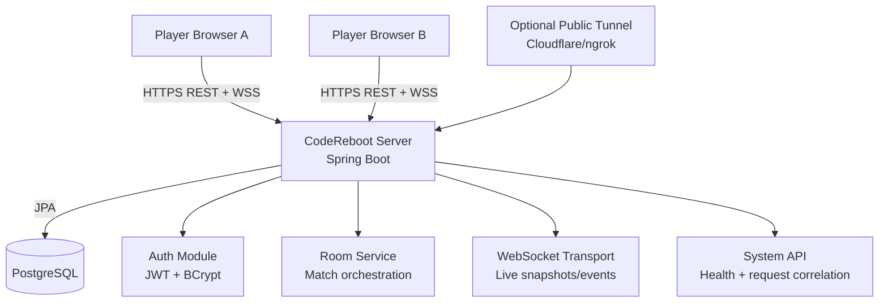
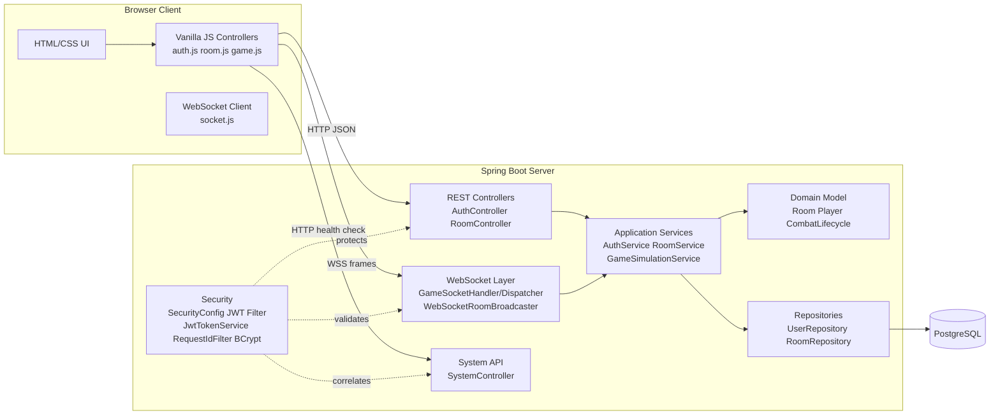
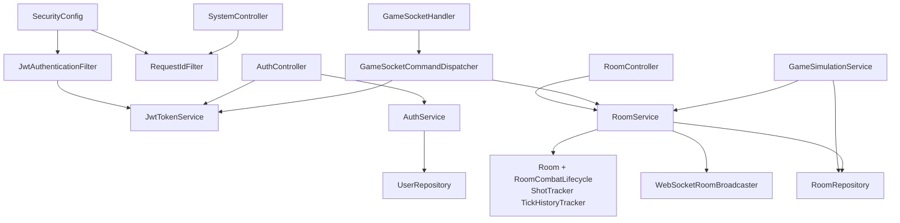
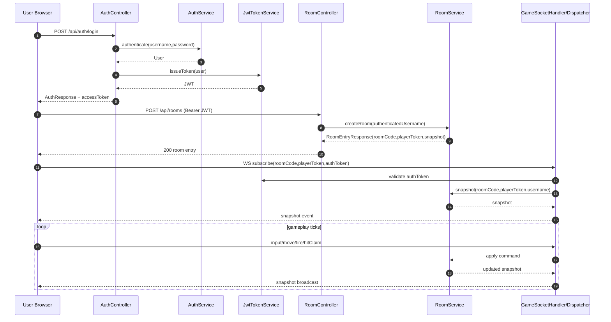
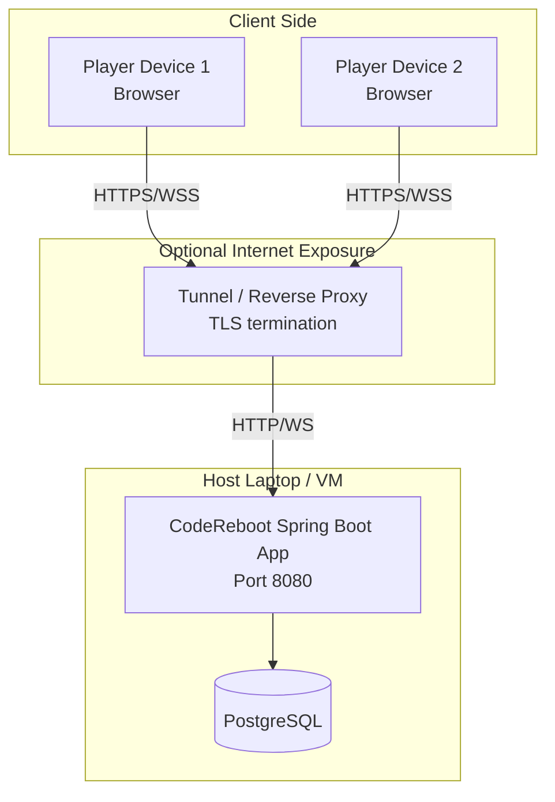

# CodeReboot Architecture Views (Mermaid)

These views are aligned with the evaluation scheme expectation of architectural documentation using views, rationale, and quality considerations.

## 1) System Context View

## 2) Container View

## 3) Component (Server Internal) View

## 4) Runtime Sequence View (Login + Room Create + Match Loop)

## 5) Deployment View

## Quality Attribute Traceability Notes

- Performance and responsiveness:
  - WebSocket snapshots and command dispatch reduce polling overhead.
  - In-memory room state avoids DB write path for per-frame gameplay.

- Security:
  - JWT authentication for protected room APIs and websocket subscribe.
  - BCrypt password hashing and validation boundaries in AuthService.
    - Request ID propagation keeps logs and API errors traceable without external observability tooling.

- Modifiability:
  - Clear layering: API -> Application -> Domain -> Infrastructure.
  - Transport concerns are isolated from domain combat rules.

- Testability:
  - Unit tests cover domain combat/room logic and websocket parsing/dispatch behavior.
    - MVC and filter tests cover the health endpoint and request correlation path.
